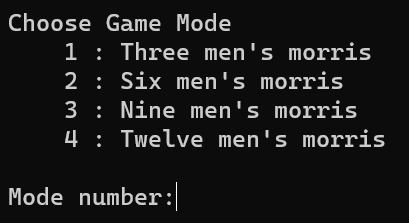
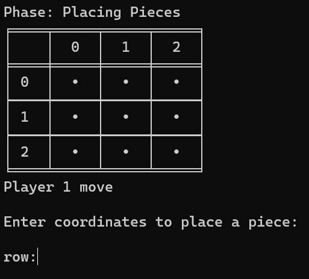
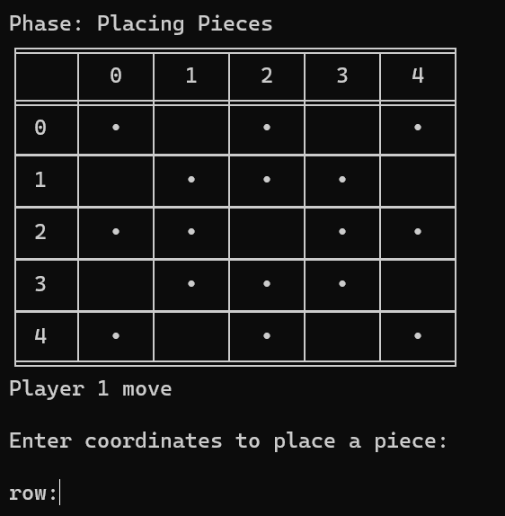
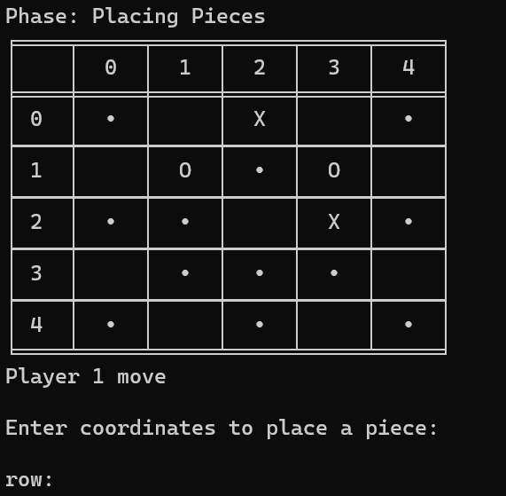

# Nine Men's Morris Game
Nine Men's Morris implementation with AI player.
## Configuration and running
Requirements:
    python3.9
    tabulate==0.9.0
To run program, run ui_game.py file

`python3 -m ui_game`

## Game description
* In the main menu you can choose the __size of the board__. There are 4 possible variations: __Three__,__ Six__, __Nine__ or __Twelve__ men's morris, each with different number of points. Different board sizes have different game phases and game rules. For details go to [Wikipedia Nine Men's Morris page](https://en.wikipedia.org/wiki/Nine_men%27s_morris)

* Next you can choose the __two player's mode__ or a game with the computer

* Player puts pawns on the board by typing the __coordinates__ of desired point.

## AI player mode
The computer player checks possible future moves and predicts the optimal move using __MiniMax__ algorithm with  __alpha-beta pruning__. The depth of search is set to 4.
## Gameplay screenshots
Start Menu:

Three Men's Morris board:

Six Men's Morris board:

Players symbols:

